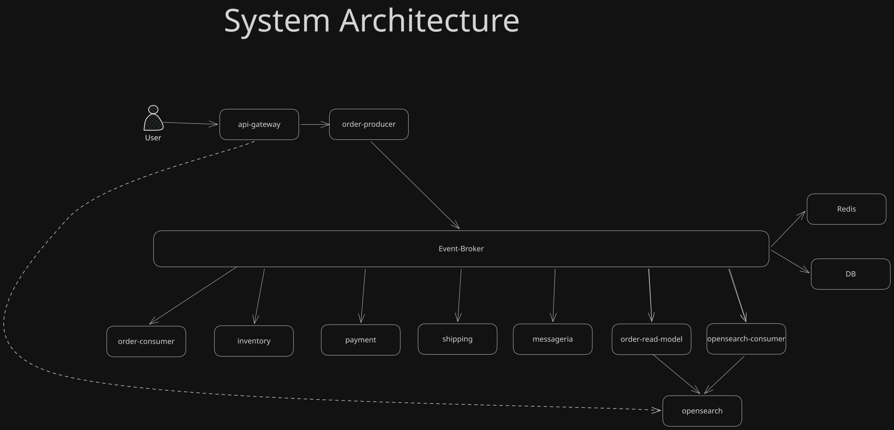

# Event-Driven E-Commerce POC

A Proof of Concept demonstrating an **event-driven microservices architecture** with Kafka, PostgreSQL (per service), Redis, and OpenSearch. Built for architecture interviews and technical demos.



---

## Overview

| Component            | Role                                                                                                        |
| -------------------- | ----------------------------------------------------------------------------------------------------------- |
| **Kafka**            | Event broker; all events use partition key `orderId` for per-order ordering.                                |
| **PostgreSQL**       | One database per service (order, inventory, payment, shipping, messageria).                                 |
| **Redis**            | Product-level locks for inventory (`product-lock:{productId}`), 15 min TTL; released after reserve.         |
| **OpenSearch**       | Read model for order search; optional event-audit index.                                                    |
| **Node.js / NestJS** | Monorepo with shared libs (`@app/contracts`, `@app/kafka`, `@app/redis`, `@app/opensearch`, `@app/config`). |

---

## Applications (what each one does)

| Application                                | Type                | Responsibility                                                                                                                                                                                                                                                                                                                                         |
| ------------------------------------------ | ------------------- | ------------------------------------------------------------------------------------------------------------------------------------------------------------------------------------------------------------------------------------------------------------------------------------------------------------------------------------------------------ |
| **api-gateway**                            | HTTP API            | Single entry point. Proxies `POST /orders` and `GET /orders/:id` to the order producer; `GET /orders/search` queries OpenSearch (read model). No auth (POC).                                                                                                                                                                                           |
| **order-producer-microservice**            | Producer + DB       | Receives create-order via HTTP. Writes order + outbox row in one transaction. Worker polls outbox and publishes **OrderCreated** to `order.events`.                                                                                                                                                                                                    |
| **order-consumer-microservice**            | Consumer            | Subscribes to `shipping.events` and `payment.events`. On **ShipmentCreated** marks order CONFIRMED and publishes **OrderConfirmed**; on **PaymentFailed** marks order CANCELLED and publishes **OrderCancelled**. Uses retry + DLQ (`order.dlq`).                                                                                                      |
| **inventory-consumer-microservice**        | Consumer + Producer | Subscribes to `order.events` and `payment.events`. On **OrderCreated**: acquires Redis lock per product (with retry/jitter), decrements stock, creates reservation, publishes **StockReserved** or **StockReservationFailed**. On **PaymentFailed**: releases stock and reservations, publishes **StockReleased**. Uses retry + DLQ (`inventory.dlq`). |
| **payment-consumer-microservice**          | Consumer + Producer | Subscribes to `inventory.events`. On **StockReserved** publishes **PaymentCaptured** (simulated). Uses retry + DLQ (`payment.dlq`).                                                                                                                                                                                                                    |
| **shipping-consumer-microservice**         | Consumer + Producer | Subscribes to `payment.events`. On **PaymentCaptured** creates shipment and publishes **ShipmentCreated**. Uses retry + DLQ (`shipping.dlq`).                                                                                                                                                                                                          |
| **messageria-consumer-microservice**       | Consumer + Producer | Subscribes to `order.events`, `payment.events`, `shipping.events`. Sends notifications (e.g. ORDER_CREATED, ORDER_PAID, ORDER_SHIPPED, ORDER_CONFIRMED, ORDER_CANCELLED) and publishes **NotificationSent** to `notification.events`. Uses retry + DLQ (`notification.dlq`).                                                                           |
| **order-read-model-consumer-microservice** | Consumer + Producer | Subscribes to all event topics. Builds one OpenSearch document per order: `orderId`, `status` (PENDING/CONFIRMED/CANCELLED), `timeline[]` of event labels. Used by the gateway for search. Uses retry + DLQ (`order.dlq`).                                                                                                                             |
| **opensearch-consumer-microservice**       | Consumer            | Subscribes to event topics and indexes raw events into an audit index (optional event log).                                                                                                                                                                                                                                                            |

---

## Event flow

**Happy path**

1. `POST /orders` → order-producer creates order + outbox → worker publishes **OrderCreated** to `order.events`.
2. Inventory consumes **OrderCreated** → reserves stock (Redis lock + DB) → **StockReserved** to `inventory.events`.
3. Payment consumes **StockReserved** → **PaymentCaptured** to `payment.events`.
4. Shipping consumes **PaymentCaptured** → **ShipmentCreated** to `shipping.events`.
5. Order-consumer consumes **ShipmentCreated** → marks order CONFIRMED → **OrderConfirmed** to `order.events`.
6. Messageria consumes **OrderConfirmed** → notification + **NotificationSent**.

**Failure path (e.g. payment fails)**  
Inventory consumes **PaymentFailed** → releases stock → **StockReleased**. Order-consumer consumes **PaymentFailed** → marks order CANCELLED → **OrderCancelled**. Messageria notifies.

**Topics**  
`order.events`, `inventory.events`, `payment.events`, `shipping.events`, `notification.events`, plus DLQ topics: `order.dlq`, `inventory.dlq`, `payment.dlq`, `shipping.dlq`, `notification.dlq`. All created by `kafka-init` in Docker.

---

## Resilience: retry and DLQ

Every consumer uses the same pattern: **retry with exponential backoff** (configurable attempts/delays), then on final failure **publish the message to the service DLQ** (envelope with `sourceTopic`, `partitionKey`, `originalMessage`, `error`, `attemptCount`, `consumer`). The consumer then commits the offset so the event is not redelivered indefinitely. Implemented in `libs/kafka` (`withRetryAndDlq`, `emitToDlq`). Consumers that also produce business events (inventory, payment, shipping, messageria) reuse the same Kafka producer for DLQ.

---

## Run locally

```bash
pnpm install
docker compose up -d --build
```

**Ports**

- **API Gateway:** http://localhost:3000
- **Swagger UI:** http://localhost:3000/api
- **OpenSearch:** 9200 | **Dashboards:** 5601 | **Conduktor:** 8080 | **Redis:** 6379

**Seed (required for orders with products)**  
Product IDs in the read model come from inventory seed:

```bash
pnpm run seed:inventory
```

**HTTP examples**  
Use the `client.http` file in the repo (REST Client extension): create order, get by ID, search (optional `?q=`, `?status=`). The create-order request is named so later requests can reuse the returned `orderId`.

- Create: `POST http://localhost:3000/orders` with body `{ "items": [ { "productId": "prod-001", "quantity": 2 } ] }`
- Get: `GET http://localhost:3000/orders/:orderId`
- Search: `GET http://localhost:3000/orders/search`, `?status=PENDING`, `?status=CONFIRMED`, `?q=orderId`

---

## Scripts

| Command                                                 | Description                                                                                           |
| ------------------------------------------------------- | ----------------------------------------------------------------------------------------------------- |
| `pnpm run build`                                        | Build default app (api-gateway).                                                                      |
| `pnpm run start:api-gateway`                            | Run API gateway with watch.                                                                           |
| `pnpm run start:order-producer-microservice`            | Run order producer with watch.                                                                        |
| `pnpm run start:order-consumer-microservice`            | Run order consumer with watch.                                                                        |
| `pnpm run start:inventory-consumer-microservice`        | Run inventory consumer with watch.                                                                    |
| `pnpm run start:payment-consumer-microservice`          | Run payment consumer with watch.                                                                      |
| `pnpm run start:shipping-consumer-microservice`         | Run shipping consumer with watch.                                                                     |
| `pnpm run start:messageria-consumer-microservice`       | Run messageria consumer with watch.                                                                   |
| `pnpm run start:order-read-model-consumer-microservice` | Run order read-model consumer with watch.                                                             |
| `pnpm run migrate:deploy`                               | Apply all Prisma migrations (all services). Run once when Postgres is up (e.g. local or dev compose). |
| `pnpm run prisma:generate`                              | Generate Prisma clients for all service schemas.                                                      |
| `pnpm run seed:inventory`                               | Seed inventory products (run after migrate).                                                          |
| `pnpm run test`                                         | Unit tests.                                                                                           |
| `pnpm run lint`                                         | ESLint with fix.                                                                                      |

Migrations also run automatically when production containers start (`prisma migrate deploy`).

---

## Prisma (ORM)

Each service that uses PostgreSQL has its own schema and client:

- `apps/order-producer-microservice/prisma/`
- `apps/order-consumer-microservice/prisma/`
- `apps/inventory-consumer-microservice/prisma/`
- `apps/payment-consumer-microservice/prisma/`
- `apps/shipping-consumer-microservice/prisma/`
- `apps/messageria-consumer-microservice/prisma/`

Databases: `order_db`, `inventory_db`, `payment_db`, `shipping_db`, `messageria_db` (via `*_DATABASE_URL` in `.env`).

---

## Design highlights

- **Transactional outbox** (order-producer): order and outbox row in one transaction; background worker publishes to Kafka so at-least-once delivery is decoupled from the HTTP response.
- **Idempotent consumers**: each service stores `processed_events` (by `eventId` + consumer); duplicate events are skipped.
- **Product lock**: key `product-lock:{productId}` in Redis (value = `orderId`), NX + TTL; compare-and-delete on release; items aggregated by `productId` before locking to avoid duplicate keys when the same product appears twice in an order.
- **Partition key**: `orderId` on all events so ordering is preserved per order.
- **OpenSearch read model**: one document per order with `orderId`, `status`, `timeline[]`; gateway search uses `status.keyword` for exact status filter.
- **DLQ**: failed messages after retries go to per-service DLQ topics for inspection or replay.
